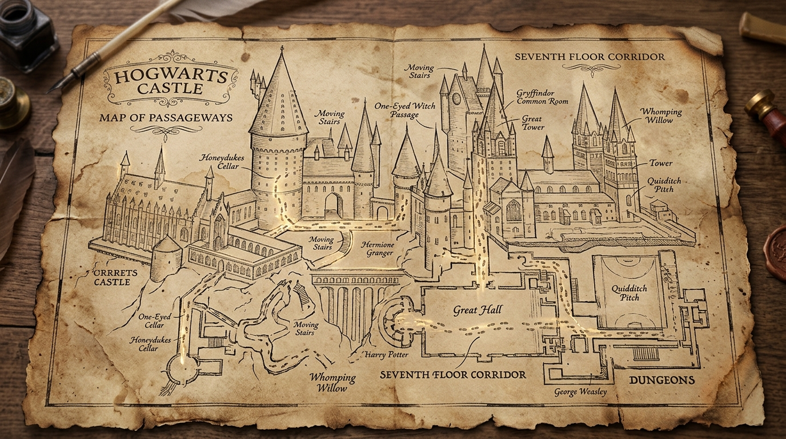

# ⚡ Krishna Makwana — Harry Potter Themed Portfolio

<p align="center">
  
</p>

<p align="center">
  <strong>An immersive, interactive, Harry Potter-themed personal portfolio showcasing full-stack projects, magical UI/UX animations, and engineering capabilities.</strong>
</p>

<p align="center">
  
  
  
  
  
</p>

---

## ✨ Features

- **🪄 Elder Wand Interactive Cursor**: Custom dynamic wand cursor equipped with shimmering lumos particles and sparkle trails.
- **🏰 Hogwarts House Switcher**: Seamlessly switch between Gryffindor, Slytherin, Ravenclaw, and Hufflepuff with real-time CSS variable color palettes and emblem switching.
- **🔮 Cauldron Vortex & Nimbus Flying Animations**: Interactive WebGL / Canvas visual effects including potion bubbling and sweeping Nimbus transitions.
- **📜 Hedwig's Owl Post Dispatch**: Interactive contact dispatch interface with audio synthesis chimes and golden snitch confetti celebration.
- **✨ Spotlight & Fluid Distortion Effects**: Interactive cursor-driven distortion and illuminated spotlight reveals for project cards.
- **📱 Fully Responsive Design**: Optimized across mobile, tablet, laptop, and ultra-wide displays.

---

## 🛠️ Tech Stack

- **Core**: Vanilla JavaScript (ES6+ Modules), HTML5 Semantic Architecture
- **Styling**: Vanilla CSS3 (Custom Properties, Glassmorphism, Responsive Grid/Flexbox)
- **Bundler & Build Tool**: [Vite](https://vitejs.dev/)
- **Animation & Physics**: [GSAP (GreenSock)](https://greensock.com/gsap/), [Lenis Smooth Scroll](https://lenis.darkroom.engineering/), [Canvas Confetti](https://www.npmjs.com/package/canvas-confetti)
- **Icons**: [Lucide Icons](https://lucide.dev/)

---

## 📂 Project Structure

```text
├── public/
│   └── assets/             # Images, crests, wand cursors, backgrounds
├── src/
│   ├── js/
│   │   ├── audio-synth.js       # Web Audio API procedural sound engine
│   │   ├── broom-engine.js      # Nimbus flight animation engine
│   │   ├── skills-constellation.js # 3D Golden Snitch & orbital skills engine
│   │   ├── eye-tracker.js       # Eye tracking effect
│   │   ├── fluid-distortion.js  # Fluid wave distortion shaders
│   │   ├── hero-scroll.js       # Scroll-triggered animations
│   │   ├── house-switcher.js    # Hogwarts house dynamic theme engine
│   │   ├── main.js              # Application entrypoint
│   │   ├── owl-post.js          # Hedwig contact form engine
│   │   ├── spotlight-reveal.js  # Card spotlight illumination
│   │   └── wand-cursor.js       # Elder Wand spark & trail cursor
│   └── styles/
│       ├── about.css            # About section styles
│       ├── contact.css          # Owl post form styles
│       ├── hero.css             # Hero & portrait banner styles
│       ├── main.css             # Global typography & layout
│       ├── projects.css         # Project showcases & spell cards
│       ├── skills.css           # Skills grid styling
│       └── variables.css        # House colors & design tokens
├── index.html              # Main HTML markup
├── package.json            # Project dependencies and npm scripts
├── vite.config.js          # Vite configuration
├── .env.example            # Environment variables template
├── .gitignore              # Git ignore rules
└── README.md               # Repository documentation
```

---

## 🚀 Getting Started

### Prerequisites

Ensure you have [Node.js](https://nodejs.org/) installed (v18.0.0 or higher recommended).

### Installation

1. Clone the repository:
   ```bash
   git clone https://github.com/YOUR_USERNAME/harry-potter-portfolio.git
   cd harry-potter-portfolio
   ```

2. Install dependencies:
   ```bash
   npm install
   ```

3. Create your local environment file:
   ```bash
   cp .env.example .env
   ```

4. Start the local development server:
   ```bash
   npm run dev
   ```
   Open `http://localhost:3000` in your browser.

---

## ⚙️ Available Scripts

| Command | Description |
| :--- | :--- |
| `npm run dev` | Starts local development server on `http://localhost:3000` |
| `npm run build` | Compiles and optimizes assets into production-ready `dist/` bundle |
| `npm run preview` | Locally previews production build |

---

## 🌐 Deployment

### GitHub Pages
1. Build the project:
   ```bash
   npm run build
   ```
2. Deploy the `dist` folder to the `gh-pages` branch or configure GitHub Actions.

### Vercel / Netlify
- **Build Command:** `npm run build`
- **Output Directory:** `dist`
- **Install Command:** `npm install`

---

## 📄 License

This project is licensed under the [MIT License](LICENSE).
